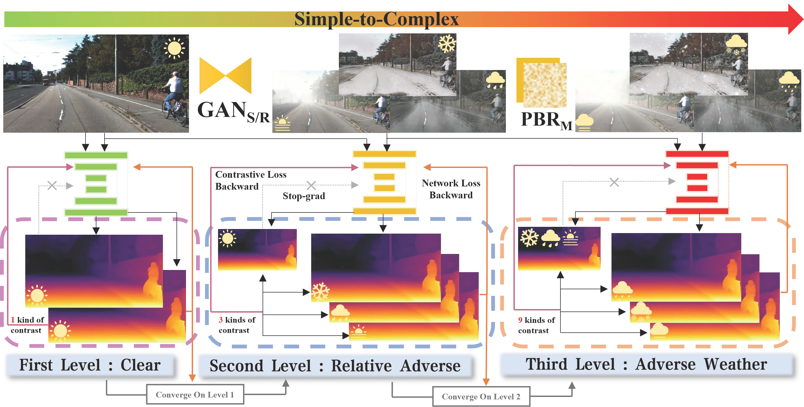

<div align="center">
<h2>WeatherDepth: Curriculum Contrastive Learning for Self-Supervised Depth Estimation under Adverse Weather Conditions</h2>
<a href='https://scholar.google.com/citations?user=subRjlcAAAAJ&hl=zh-CN' target='_blank'>Jiyuan Wang</a><sup>1</sup>•<a href='https://scholar.google.com/citations?hl=zh-CN&user=t8xkhscAAAAJ' target='_blank'>Chunyu lin</a><sup>1</sup>•<a href='https://scholar.google.com/citations?hl=zh-CN&user=vo__egkAAAAJ' target='_blank'>Lang Nie</a><sup>1</sup>•<a href='XXX' target='_blank'>Shujun huang</a><sup>1</sup>

<sup>1</sup>Beijingjiaotong University

**ICRA 2024**

[](https://arxiv.org/abs/2310.05556v2) [](https://www.youtube.com/watch?v=N32ZrEMvlmA&ab_channel=%E7%8E%8B%E7%BA%AA%E5%85%83) [](https://www.bilibili.com/video/BV1g2vaesExb/?spm_id_from=333.999.0.0&vd_source=26e502acdab568d5b3145439da039be8)  [](https://wangjiyuan9.github.io/project/weatherkitti/)


<div style="text-align:center">
<!--  -->
</div>
</div>

## 📢 Upcoming releases & Catalog

- [x] [release code for testing](#-pretrained-weights-and-evaluation)
- [x] [model release](#-pretrained-weights-and-evaluation) (WeatherDepth, WeatherDepth*, Weatherdepth$^\dagger$)
- [x] [test data release](#-dataset-preparation)(WeatherKITTI, CADC; DrivingStereo has already available)
- [x] [release code for training](#-training)
- [x] realease the [introduction video]() for the paper
- [x] [train/validate data release]()
- [x] **!NEW!** [CycleGAN weight release](https://wangjiyuan9.github.io/project/weatherkitti/) CLICK LEFT!

## 🛠️Environment Setup

We implement our method on three baselines, and their environments are the same as their baselines. Therefore, you can refer to:

- [**PlaneDepth**(CVPR2023)](https://github.com/svip-lab/PlaneDepth/tree/main)
- [**MonoViT**(3DV2022)](https://github.com/zxcqlf/MonoViT)
- [**WaveletMonoDepth**(CVPR2021)](https://github.com/nianticlabs/wavelet-monodepth)

The inference code was tested on:

- Ubuntu 18.04 LTS, Python 3.8.8, CUDA 11.3, GeForce RTX 3090 (pip, Conda)
- Ubuntu 16.04 LTS, Python 3.7.15, CUDA 10.0, GeForce RTX 2080Ti (pip, Conda)

You should arrange your file tree as:
```bash
├── Evaluate.py
├── README.md
├── ckpt
│   ├── mpvit_small.pth
│   ├── weatherdepthPld
│   │   ├── depth.pth
│   │   └── encoder.pth
│   ├── weatherdepthVit
│   │   ├── depth.pth
│   │   └── encoder.pth
│   └── weatherdepthWav
│       ├── depth.pth
│       └── encoder.pth
...Other files
```

## 🖼️ Dataset Preparation

You can download the WeatherKITTI test/full dataset from the following links (Excluding sunny scenes (denoted as 'rgb'), which is the [**KITTI dataset**](https://www.cvlibs.net/datasets/kitti/raw_data.php), corresponding to the RGB part of the file tree).  

Download the [**WeatherKITTI** ](https://wangjiyuan9.github.io/project/weatherkitti/),
The data tree should be arranged as:

```bash
kitti
├── fog
│    ├──2011_09_26_drive_0001_sync
│    │    ├── image_02
│    │    │   ├── 150m
│    │    │   └── 75m
│    │    └── image_03
│    │        ├── 150m
│    │        └── 75m
│    ├──...
├── mix_rain
├── mix_snow
├── raingan
├── rgb
     ├──2011_09_26_drive_0001_sync
│    │    ├── image_02
│    │    │   └── data
│    │    ├── image_03
│    │    │   └── data
│    │    ├── oxts
│    │    │   └── data
│    │    └── velodyne_points
│    │        └── data
│    ├──...
├── snowgan
└── splits
```
<!-- You can use the CADC and DrivingStereo datasets to evaluate the model's robustness. You can download the datasets from the following links:
- Snowy image at [CADC_devkit](https://github.com/mpitropov/cadc_devkit) and GT depth at [here](https://drive.google.com/file/d/18brjQkqo8tFEYCiG3OlveSGxJ3dn3zOf/view?usp=sharing)
- Rainy/Foggy image and their GT depth at [DrivingStereo](https://drivingstereo-dataset.github.io/)

The data tree should be arranged as:
```bash
├──cadcd
|   ├── 2018_03_06
|   ├── 2018_03_07
|   ├── 2019_02_27
|   └── gt_depths.npy
└──drivingstereo
    ├── foggy
    │   ├── depth-map-full-size
    │   └── left-image-full-size
    └── rainy
        ├── depth-map-full-size
        └── left-image-full-size
``` -->
----
### **Splits**

The train/test/validation splits are defined in the **`splits/`** folder.

For monocular training (MonoViT baseline), the code will train a depth model using [Zhou's subset](https://github.com/tinghuiz/SfMLearner) of the standard Eigen split of KITTI, which is designed for monocular training.
Folder as `splits/eigen_zhou`.

For stereo-only training (PlaneDepth baseline), we can use the full Eigen training set – see paper for details.
Folder as `splits/eigen_full`.

## 💾 Pretrained weights and evaluation

| Models             | abs rel | sq rel | rmse  | rmse_log   | a1    | a2    | a3    |
|--------------------|---------|--------|-------|------------|-------|-------|-------|
| [WeatherDepth](https://drive.google.com/drive/folders/13evrsuXDnuw6UO7dH0YieYLpC5C2qIJf?usp=sharing)   | 0.099   | 0.673  | 4.324 | 0.185    | 0.884 | 0.959 | 0.981 |
| [WeatherDepth*](https://drive.google.com/drive/folders/1lWwkeYGrZw6cHlUL9RAuENWN5tNDOAnZ?usp=sharing)  | 0.103   | 0.738  | 4.414 | 0.178    | 0.892 | 0.965 | 0.984 |
| [WeatherDepth+ ](https://drive.google.com/drive/folders/1MC8YCbydUNcBFUQ083yNQJfE5niV43X0?usp=sharing) | 0.103   | 0.777  | 4.532 | 0.191    | 0.878 | 0.958 | 0.981 |


-------------------
### To evaluate the model on WeatherKITTI, you can run the following command:
- WeatherDepth
```bash
python Evaluate.py --data_path data/kitti --eval_stereo --net_type plane --width 1280 --height 384 --load_weights_folder ckpt/weatherdepthPld --eval_split eigen_raw -twt -tww
```

- WeatherDepth*
```bash
python Evaluate.py --data_path data/kitti --eval_mono --net_type vit --width 640 --height 192 --load_weights_folder ckpt/weatherdepthVit --eval_split eigen_raw -twt -tww
```

- WeatherDepth+
```bash
python Evaluate.py --data_path data/kitti --eval_stereo --net_type wav --width 1024 --height 320 \
    --load_weights_folder ckpt/weatherdepthWav \
    --eval_split eigen_raw -twt -tww
```

- WeatherDepth -Ours
```bash
python Evaluate.py --data_path data/kitti --eval_mono --net_type mbvit --width 640 --height 192 \
        --load_weights_folder logs/WeatherDepthViT_cur4_all/24 \
        --eval_split eigen_raw -twt -tww
```


## ⏳ Training
**Monocular training:(MonoViT)**

```shell
python -u train.py \
    --data_path data/kitti \
    --model_name WeatherDepthViT \
    --net_type vit \
    --log_dir logs \
    --train_strategy cur \
    --num_epochs 60 \
    --weather all \
    --cur_vis 4 \
    --contrast_with 0 0 1 \
    --cta_wadd 0.02 \
    --max_patience 0 \
    --split eigen_zhou \
    --gan -ss --do_save 
```

**Ours**
```shell
python -u train.py \
    --data_path data/kitti \
    --model_name WeatherDepthViT \
    --net_type mbvit \
    --log_dir logs \
    --train_strategy cur \
    --num_epochs 60 \
    --weather all \
    --cur_vis 4 \
    --split eigen_zhou \
    --contrast_with 0 0 1 \
    --cta_wadd 0.02 \
    --max_patience 0 \
    --gan -ss --do_save 
```

**Stereo training:(Planedepth)**

```shell
python -u train.py \
        --data_path data/kitti \
        --model_name WeatherDepthPld \
        --log_dir logs \
        --train_strategy cur \
        --cur_vis 5 \
        --num_epochs 60 \
        --weather all \
        --contrast_with 0 0 1 \
        --cta_wadd 0.01 \
        --net_type plane \
        --max_patience 1 \
        --gan -ss --do_save 
```

To facilitate the reproduction of our model, we provide the training logs for the above commands at [here](./assets). **These logs are the training records of the models presented in the paper.** (For Planedepth, we used multi-GPU parallel training.)
## 🎓 Citation
```bibtex
@misc{wang2023weatherdepth,
    title={WeatherDepth: Curriculum Contrastive Learning for Self-Supervised Depth Estimation under Adverse Weather Conditions},
    author={Jiyuan Wang and Chunyu Lin and Lang Nie and Shujun Huang and Yao Zhao and Xing Pan and Rui Ai},
    year={2023},
    eprint={2310.05556},
    archivePrefix={arXiv},
    primaryClass={cs.CV}
}
```

## 📚 Acknowledgements and License
This project is licensed under the MIT License - see the [LICENSE](LICENSE) file for details. The code is based on the PlaneDepth, MonoViT, and WaveletMonoDepth repositories. We thank the authors for their contributions. The data is based on the KITTI, CADC, and DrivingStereo datasets. We thank the authors for their contributions. If you have any questions, please feel free to contact us with issues or email.
